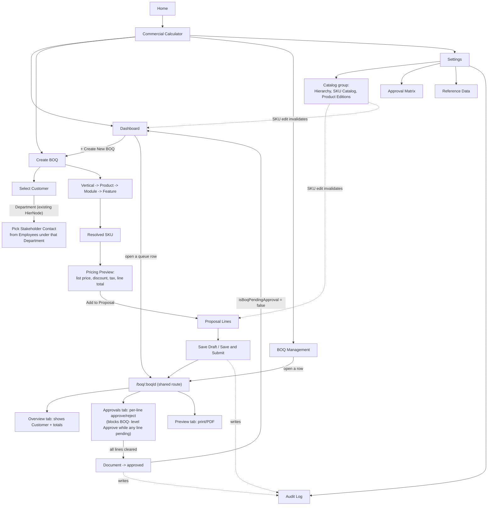

# Commercial Calculator — Navigation, Pricing, Audit & Approval Blueprint

**Scope of this document:** no code, no commits, no fake data. This is the pre-implementation blueprint requested for six changes to the Commercial Calculator: (1) move SKU Catalog/Product Editions under Settings, (2) show SKU pricing before adding a line to a BOQ, (3) remove Dashboard's Recent Activity in favor of the Audit Log, (4) source BOQ customer data from existing AMNEX records, (5) find the root cause of "approved BOQs still show under Pending Approval," and (6) preserve draft-vs-frozen commercial value behavior. Every finding below was traced against the actual code in `src/modules/commercial-calculator/` and `src/data/repository.ts` as of commit `73ebe732` (2026-08-12), not assumed from the FRS or prior design docs.

**Prior art this builds on:** this module already went through a full business-logic reverse-engineering pass and two rounds of IA redesign (`docs/superpowers/analysis/2026-08-03-commercial-calculator-business-analysis.md`, `-information-architecture.md`, `-ia-review-round2.md`) — the current live nav (Dashboard / Create BOQ / BOQ Management / **Catalog** / **Settings**) is the direct, stakeholder-confirmed output of that work, implemented in `2026-08-03-commercial-calculator-catalog-settings-split.md`. **Requirement #1 below reopens a decision that round explicitly made** — see the flag at the top of §1 before implementing it as literally stated.

---

## 0. Key findings up front

| # | Requirement | Finding |
|---|---|---|
| 1 | Move SKU Catalog/Product Editions under Settings | **Conflicts with a confirmed prior decision.** IA review round 2 (2026-08-03) deliberately *removed* SKU Catalog/Product Editions from an admin-flavored bucket because Commercial/Product Ops treats them as daily work, not occasional config — and put them in their own peer "Catalog" tab instead of "Settings," specifically so a future permission model doesn't lump their primary job in with rare system administration. Folding them back into Settings undoes that reasoning. Flagged as Open Question 1 — proceed only after confirming intent. |
| 2 | Show SKU pricing before adding to proposal | **Real, confirmed gap.** `CreateBoq.tsx`'s picker (lines 344–391) shows the generated SKU code, name, and tax % once a Feature resolves to a SKU — but never list price, the discount-adjusted unit price, or the line total the current Qty/Discount would produce. That math only appears in the line row *after* "Add to Proposal" is clicked. |
| 3 | Remove Recent Activity, verify Audit Log completeness | **Removal is trivial; audit log is already complete for `PCS-010`/`PCS-036`.** `AuditLog.tsx` already exists under Settings and reads the same `useAuditLogs()` data Dashboard's "Recent Activity" block duplicates. All three audit-writing entity types (`boq`, `sku`, `feature`) are captured correctly — but `AuditLog.tsx`'s filter dropdown only offers "All / BOQ / SKU," silently missing an explicit "Feature" option (feature status-change entries are real but only visible via "All"). |
| 4 | Customer selected from existing AMNEX stakeholder data | **A real customer-equivalent data source already exists and is already half-used.** `CreateBoq.tsx`'s "Department" field (`departments` from `useDepartments()`) is not an AMNEX-internal org chart — it's GOMS's model of the *government departments AMNEX sells to* (`HierNode` with `typeKey: 'department'`), and `Employee` records under each department (`useEmployeesUnder(departmentId)`) are the actual stakeholder contacts already used elsewhere in Account Mapping (`EmployeePicker.tsx`). Today, `CreateBoq.tsx`'s "Customer Information" section (lines 332–342) is 100% disconnected free text — Customer/Organization/Address/GST/Contact are typed from scratch even though Department is already selected via a real FK two sections above. |
| 5 | Fix "approved BOQs still show under Pending Approval" | **No defect found in the current status/query/cache code.** Traced `isBoqPendingApproval` (excludes `approved` explicitly), `BOQ_TRANSITIONS` (`approved` only reachable from `under_review`, only exits to `archived`), the document-level approval gate in `updateBoqStatusLogic` (blocks `→ approved` while any line is unresolved), and every mutation's React Query invalidation (`useBoqMutations.updateStatus` invalidates `qk.boqs` + `qk.dashboardMetrics`, which both Dashboard's "Pending Approvals" group and its KPI tile read from) — all correct as of `73ebe732`. **Strongest concrete lead: the Android bundle is stale.** `android/app/src/main/assets/public/assets/CommercialCalculatorWorkspace-DG1PgiSu.js` was last built 2026-08-04 09:44; the web `dist/` bundle was rebuilt 2026-08-10 11:46 and the source has moved on again since (`e5c79070`, `73ebe732`, both 2026-08-10/12). Anyone testing on-device (not `npm run dev`) is running code from over a week ago. See Open Question 2. |
| 6 | Draft-reflects-current / submitted-retains-captured / dashboard-refreshes-on-SKU-change | **Already correctly implemented — as of yesterday's commit.** `withLiveDraftPricing`/`withLiveDraftGrandTotal` (`repository-logic.ts:319–339`, added in `73ebe732`) recompute a line's `unitPrice`/`taxPct`/`lineTotal` from the SKU's *current* data only while `boq.status === 'draft'`; every other status returns the frozen snapshot taken at add-time. `useSkuMutations`'s `invalidate()` already hits `qk.boqs`, `qk.boqLineItems`, and `qk.dashboardMetrics` on every SKU edit. This is the one requirement that needs no new work — only regression protection while touching the other five. |

---

## 1. Current-state sitemap

```text
Home
└── Commercial Calculator  (/commercial-calculator/:section?/:boqId?)
    ├── Dashboard              KPIs, Draft/Pending/Approved/Rejected queues, Recent Activity, "More:" links
    ├── Create BOQ             Opportunity → Customer (free text) → Commercial Config → Pricing → Approval Summary → Preview → Save/Submit
    ├── BOQ Management         Search/filter list of all BOQs → opens shared BOQ detail route
    ├── Catalog                (peer tab, one flat sidebar group)
    │   ├── Hierarchy              Vertical → Product → Module → Feature tree
    │   ├── SKU Catalog            SKU list/detail (Costs/Pricing/BOM tabs)
    │   └── Product Editions       Edition list + Edition↔Feature mapping dialog
    ├── Settings                (peer tab, three labeled sidebar groups)
    │   ├── Approval Matrix        discount-band rules
    │   ├── Reference Data          Currencies, UOM, Billing Types, Tax Classes, SKU Categories, Pre-Sales
    │   └── Audit Log               global, filterable (All/BOQ/SKU)
    └── /boq/:boqId              (shared route, not a tab — reached from Dashboard queues,
                                   BOQ Management rows, or Create BOQ's hand-off on save)
        └── ProposalDetail: Overview | Approvals | Preview (print) tabs
```

**Entry points into the shared `/boq/:boqId` route today:** Dashboard's four BOQ queue groups, BOQ Management's row click, Create BOQ's `onCreated` hand-off, and "Revise" from a terminal BOQ. This "two entry points, one journey" shape (IA doc §6) stays unchanged by every requirement below — none of them touch this route's addressing.

---

## 2. Proposed sitemap

Two independent changes, shown together; §Open Question 1 covers whether change (a) should actually happen as literally requested.

```text
Home
└── Commercial Calculator
    ├── Dashboard              KPIs, Draft/Pending/Approved/Rejected queues — Recent Activity REMOVED (req #3)
    ├── Create BOQ             Opportunity → Customer (department-scoped stakeholder picker, req #4)
    │                            → Commercial Config → live Pricing Preview (req #2) → Approval Summary
    │                            → BOQ Preview → Save/Submit
    ├── BOQ Management         unchanged
    └── Settings                 (req #1: Catalog's contents fold in here — see Open Question 1
                                  on whether Hierarchy also moves, or only SKU Catalog + Product Editions)
        ├── Catalog                 Hierarchy, SKU Catalog, Product Editions   ← moved from the old Catalog tab
        ├── Approval Matrix
        ├── Reference Data
        └── Audit Log               unchanged content; now the sole home for activity history (req #3)
    └── /boq/:boqId
        └── ProposalDetail: Overview (now shows Customer prominently, req #4) | Approvals | Preview
```

**What does NOT change:** the `/boq/:boqId` shared-route pattern, `BOQ_TRANSITIONS`, the approval-gate logic, `withLiveDraftPricing`, every existing master screen's internals (`MasterCrudScreen`, `SkuFormDialog`, `SkuBomEditor`, `EditionFeatureMappingDialog`, `HierarchyView`).

**What literally changes structurally:** the `Catalog` top-level tab disappears; its three items become a fourth sidebar group inside `Settings` (mirroring exactly how `CommercialCalculatorWorkspace.tsx`'s existing `SidebarTabPage`/`ITEM_CONTENT` machinery already supports an arbitrary number of groups per tab — this is a nav-array change, the same shape as the Aug 7 Catalog/Settings split, not a new component).

---

## 3. Feature connection / flow diagram



---

## 4. Screen-level low-fidelity wireframes

### Dashboard

```text
┌─────────────────────────────────────────────────────────────────┐
│ Commercial Calculator                      [ + Create New BOQ ] │
├─────────────────────────────────────────────────────────────────┤
│ [Draft] [Pending Approval] [Approved] [Rejected] [Value] [Margin]│
├─────────────────────────────────────────────────────────────────┤
│ Continue Draft         │ Pending Approvals                      │
│  • BOQ-2026-001 ...     │  • BOQ-2026-004 ...                    │
│ Recently Approved      │ Recently Rejected                      │
│  • BOQ-2026-002 ...     │  • BOQ-2026-005 ...                    │
├─────────────────────────────────────────────────────────────────┤
│ [Recent Activity block REMOVED — req #3]                        │
├─────────────────────────────────────────────────────────────────┤
│ More: SKU Catalog · Hierarchy · Audit Log   (all -> Settings)    │
└─────────────────────────────────────────────────────────────────┘
```

### Create BOQ

```text
┌─────────────────────────────────────────────────────────────────┐
│ Create BOQ                          [Cancel] [Save Draft] [Submit]
├─────────────────────────────────────────────────────────────────┤
│ Opportunity Information                                          │
│  Opportunity Name | Department (▾ existing HierNode) | Vertical  │
│  Currency | Budget/EMD | Sales Person | Pre-Sales | BU Sales     │
├─────────────────────────────────────────────────────────────────┤
│ Customer Information                              [req #4]       │
│  Department: <selected above, read-only echo>                   │
│  Stakeholder Contact  [ search Employees under Department ▾ ]   │
│    -> auto-fills Organization / Contact name / phone / email     │
│  Address (editable, prefilled from Employee.address if present) │
│  GST (free text — no source master; see Open Question 3)        │
├─────────────────────────────────────────────────────────────────┤
│ Commercial Configuration                                          │
│  Product ▾  Module ▾  Feature ▾   Qty [ ] Discount% [ ]          │
│  Generated SKU: VER-PRD-MOD-FEA-NEW — Feature Name                │
│  ┌─ Pricing Preview [req #2, NEW] ──────────────────────────┐    │
│  │ List Price: 25,000  Post-discount: 22,500  Tax: 18%       │    │
│  │ Line Total (this config): 26,550                          │    │
│  └─────────────────────────────────────────────────────────┘    │
│                                          [ + Add to Proposal ]    │
│  Lines already added: ...                                        │
├─────────────────────────────────────────────────────────────────┤
│ Pricing Summary | Approval Summary | BOQ Preview  (unchanged)     │
└─────────────────────────────────────────────────────────────────┘
```

### BOQ Management

```text
┌─────────────────────────────────────────────────────────────────┐
│ [ Search: BOQ #, opportunity, customer... ] [Status filter ▾]    │
├─────────────────────────────────────────────────────────────────┤
│ BOQ-2026-001  v1  Opportunity X · Customer Y   [Submitted]  ₹.. │
│ BOQ-2026-002  v2  Opportunity Z · Customer W   [Approved]   ₹.. │
└─────────────────────────────────────────────────────────────────┘
        (unchanged — row click -> /boq/:boqId)
```

### BOQ Approval / Detail (`/boq/:boqId`)

```text
┌─────────────────────────────────────────────────────────────────┐
│ ← Back to BOQ Management                                         │
│ BOQ-2026-004 — Opportunity Name          [Under Review -> Approve]│
│ Customer: <Stakeholder Name> · <Department/Organization>  [req #4, made prominent]
├─────────────────────────────────────────────────────────────────┤
│ [Overview] [Approvals (2)] [Preview]                              │
├─────────────────────────────────────────────────────────────────┤
│ Overview: Version | Grand Total | Margin | Line items list       │
│ Approvals: per-line Approver ▾ / Remarks / [Approve] [Reject]     │
│   — blocks document "Approved" button while any line pending     │
│ Preview: full customer-facing document + Print/Save as PDF        │
└─────────────────────────────────────────────────────────────────┘
```

### Settings (proposed)

```text
┌───────────────┬───────────────────────────────────────────────┐
│ CATALOG       │                                                 │
│  Hierarchy    │                                                 │
│  SKU Catalog  │         <selected screen renders here>          │
│  Product Ed.  │                                                 │
│ APPROVAL MTRX │                                                 │
│  Approval Mtrx│                                                 │
│ REFERENCE DATA│                                                 │
│  Currencies…  │                                                 │
│ AUDIT         │                                                 │
│  Audit Log    │                                                 │
└───────────────┴───────────────────────────────────────────────┘
```

### SKU Catalog (unchanged internals, new parent tab)

```text
┌─────────────────────────────────────────────────────────────────┐
│ [+ New SKU]                          [ Search / Category filter ]│
├─────────────────────────────────────────────────────────────────┤
│ SKU Code | Name | Category | List Price | Status | Usage/BOQ Count│
│  ... row per SKU, click -> detail (Overview/Costs/Pricing/BOM tabs)│
└─────────────────────────────────────────────────────────────────┘
```

### Product Editions (unchanged internals, new parent tab)

```text
┌─────────────────────────────────────────────────────────────────┐
│ [+ New Edition]                                                   │
├─────────────────────────────────────────────────────────────────┤
│ Edition Name | [Features button -> EditionFeatureMappingDialog]  │
└─────────────────────────────────────────────────────────────────┘
```

### Audit Log (now the only activity surface)

```text
┌─────────────────────────────────────────────────────────────────┐
│ Entity type: [ All / BOQ / SKU / Feature (req #3: add this) ▾ ] │
├─────────────────────────────────────────────────────────────────┤
│ [BOQ]  status_change · status: submitted -> under_review          │
│        reason: "..."                          2026-08-12 18:14   │
│ [SKU]  update · listPrice: 25000 -> 27500      2026-08-11 ...    │
│ [FEATURE] status_change · status: existing -> modified            │
└─────────────────────────────────────────────────────────────────┘
```

---

## 5. Step-by-step use cases

Each: **Starting point → actions → expected result.** Written to be run as manual test cases once implemented.

### UC1 — Create a BOQ
Starting point: Dashboard → click **"+ Create New BOQ."**
Actions: fill Opportunity Name, Department, Vertical, Currency, Sales Person → fill Customer (see UC2) → configure at least one line (see UC3) → click **Save Draft**.
Expected: toast "BOQ <number> saved as draft"; redirected to `/boq/:boqId`; BOQ appears in Dashboard's "Continue Draft" and in BOQ Management with status `Draft`.

### UC2 — Select customer from AMNEX stakeholder data (req #4)
Starting point: Create BOQ, Department already selected.
Actions: open the Customer section's Stakeholder Contact picker → type part of a name → select a real `Employee` under that Department.
Expected: Organization auto-fills from the Department's name; Contact name/phone/email auto-fill from the selected Employee; Address prefills from `Employee.address` if present, editable; no field requires typing a name/org from scratch. Changing Department clears/refilters the picker's candidate list to that Department's employees only.

### UC3 — Select SKU and review pricing before adding (req #2)
Starting point: Create BOQ, Vertical selected.
Actions: pick Product → Module → Feature until a SKU resolves → set Qty and Discount % → observe the Pricing Preview block → click **Add to Proposal**.
Expected: before clicking Add, the preview shows List Price, post-discount unit price, tax %, and the computed line total for the current Qty/Discount — matching exactly what appears in the line row after Add (no discrepancy between preview and committed line).

### UC4 — Submit a BOQ
Starting point: an open draft BOQ with at least one line, all required fields filled.
Actions: click **Save & Submit** (from Create BOQ) or open the draft's detail route and click **Submitted** (from `/boq/:boqId`).
Expected: status becomes `submitted`; an audit log entry (`entityType: 'boq'`, `action: 'status_change'`) is written with the typed reason; BOQ leaves "Continue Draft" and appears in Dashboard's "Pending Approvals" group and KPI count.

### UC5 — Approve a BOQ
Starting point: a BOQ in `under_review` with all lines either `auto_approved` or already individually `approved`/`rejected`.
Actions: open `/boq/:boqId` → click **Approved** → enter a reason.
Expected: status becomes `approved`; a toast confirms; an audit entry is written; the BOQ disappears from "Pending Approvals" and appears in "Recently Approved" **on the very next Dashboard render**, without a manual page refresh (React Query invalidation of `qk.boqs`/`qk.dashboardMetrics` already covers this).

### UC6 — Reject a BOQ
Starting point: a BOQ in `under_review`.
Actions: open `/boq/:boqId` → click **Rejected** → enter a reason.
Expected: status becomes `rejected`; appears in "Recently Rejected"; a **Revise** button now appears (per `BOQ_TRANSITIONS`, rejected can only move to `archived`, but `ProposalDetail.tsx` offers Revise from any terminal status to start a new revision).

### UC7 — Attempt to approve a BOQ with an unresolved line, then resolve it
Starting point: a BOQ in `under_review` with at least one line whose discount put it in a manual-approval band (`Approvals` tab shows a non-zero count).
Actions: click the document-level **Approved** button first.
Expected: the action is **blocked** — a toast/error states the number of line items still pending, matching `updateBoqStatusLogic`'s `unresolvedCount` check. Then: go to the **Approvals** tab, select an Approver for the pending line, click **Approve** on that line. Return and click the document-level **Approved** button again.
Expected: this time it succeeds (all lines now in `LINE_STATES_CLEARED_FOR_APPROVAL`).

### UC8 — Verify an approved BOQ leaves Pending Approval (req #5 regression guard)
Starting point: complete UC5 on the actual running web app (`npm run dev`, not the Android build — see Open Question 2).
Actions: immediately return to Dashboard without refreshing the browser tab.
Expected: the approved BOQ is **not** present in "Pending Approvals," and the "Pending Approval" KPI count has decremented by one. If this use case fails only on-device (Android) and passes in the browser, the root cause is the stale mobile bundle, not the web code — resync/rebuild the native app rather than touching `repository-logic.ts`.

### UC9 — Manage SKU through Settings
Starting point: Commercial Calculator → **Settings** (proposed) → Catalog group → **SKU Catalog**.
Actions: click **+ New SKU**, fill required fields (Category/Feature/Edition/UOM/Currency/Tax Class/Billing Type/costs/prices), save.
Expected: new SKU appears in the list; an audit entry is written (`entityType: 'sku'`); the SKU immediately becomes selectable in Create BOQ's picker once its Feature is chosen (if `lifecycleStatus: active` and `isSellable`).

### UC10 — Manage Product Editions through Settings
Starting point: Settings → Catalog group → **Product Editions**.
Actions: open an Edition, click **Features**, toggle a Feature mandatory/optional in `EditionFeatureMappingDialog`, save.
Expected: mapping persists and is visible on reopen. (Per the business analysis, this mapping is still not consulted by SKU creation or Create BOQ today — confirm this is acceptable to leave as reference-only for this round, or scope it in; see Open Question 4.)

### UC11 — Review Audit Log (req #3)
Starting point: Settings → **Audit Log**.
Actions: perform one SKU edit, one Feature status change, and one BOQ status transition (in any order) → return to Audit Log → filter by each entity type in turn, then "All."
Expected: all three actions appear with correct entity type, field, old/new value, reason (where required), and timestamp; filtering by "SKU" and "BOQ" shows exactly the matching rows; **filtering for the Feature status change requires "All" today** unless the dropdown gains an explicit "Feature" option (flagged in §0).

### UC12 — Change SKU price and verify draft vs. submitted/approved behavior (req #6 regression guard)
Starting point: one BOQ in `draft` and one BOQ in `submitted` (or later), both containing a line item referencing the same SKU.
Actions: go to Settings → SKU Catalog → edit that SKU's List Price → save.
Expected: reopen the **draft** BOQ — its line's unit price, tax, and line total reflect the **new** price (`withLiveDraftPricing`). Reopen the **submitted** BOQ — its line's unit price/tax/line total are **unchanged**, still the value captured when the line was added. Dashboard's "Commercial Value" and "Average Margin" KPIs update to reflect the draft BOQ's new total without a manual refresh.

---

## 6. Requirement → screen → code/data → test case mapping

| Requirement | Screen(s) | Code / data area | Test case(s) |
|---|---|---|---|
| #1 Move SKU Catalog/Product Editions under Settings | Settings (new Catalog group) | `CommercialCalculatorWorkspace.tsx`: `SECTIONS`, `CATALOG_NAV`→ merged into `SETTINGS_NAV`, `Dashboard.tsx`'s "More:" links | UC9, UC10 |
| #2 Show SKU pricing before adding | Create BOQ | `CreateBoq.tsx` (new preview block near line 383, reusing existing `lineTotal`/`conversionFactorFor`/tax lookup already computed in the file) | UC3 |
| #3 Remove Recent Activity; keep in Audit Log | Dashboard, Settings → Audit Log | `Dashboard.tsx` (delete `ActivityRow`/activity block, lines 62–72 & 129–141); `AuditLog.tsx` (`ENTITY_TYPES`, add `'feature'`) | UC11 |
| #4 Customer from AMNEX stakeholder data | Create BOQ, BOQ Approval/Detail (Overview + Preview) | `CreateBoq.tsx` Customer Information section; `@/lib/api`'s `useEmployeesUnder`; `@/features/employees/EmployeePicker.tsx` (reused, not new); `CommercialBoq` customer fields (`types.ts`) populated from Employee/HierNode instead of raw input | UC2, UC5 (Overview shows customer) |
| #5 Approved BOQs leaving Pending Approval | Dashboard, BOQ Management, `/boq/:boqId` | `repository-logic.ts` (`isBoqPendingApproval`, `BOQ_TRANSITIONS`, `updateBoqStatusLogic`); `api.ts` (`qk.boqs`, `qk.dashboardMetrics` invalidation in `useBoqMutations`); **deployment**: Android bundle vs. `dist/` staleness | UC5, UC7, UC8 |
| #6 Draft-live / submitted-frozen / dashboard-refresh | Create BOQ, `/boq/:boqId` Overview, Dashboard | `repository-logic.ts` (`withLiveDraftPricing`, `withLiveDraftGrandTotal`, `listBoqsLogic`, `getBoqLogic`, `listBoqLineItemsLogic`); `api.ts` (`useSkuMutations`/`useBomMutations` invalidation) | UC12 |

---

## 7. Implementation order

1. **Confirm Open Question 1** (does the Catalog tab actually dissolve into Settings, and does Hierarchy move too) — this gates all of #1's code, and nothing else in this list depends on it, so it can be confirmed in parallel with starting #2–#4.
2. **#3 — Remove Dashboard's Recent Activity + add the missing "Feature" audit filter option.** Smallest, most isolated change (two small edits, no data-model change, no new master), good first commit to keep momentum per the project's "commit checkpoints on long builds" practice.
3. **#2 — Pricing Preview in Create BOQ.** Pure presentation, reuses values (`lineTotal`, `conversionFactorFor`, `taxRateById`) already computed in the same file — no new hook, no new query.
4. **#4 — Customer from AMNEX stakeholder data.** Depends on nothing above; touches `CreateBoq.tsx` (new picker wiring), `ProposalDetail.tsx`'s Overview tab (surface customer more prominently), and possibly `CommercialBoq`'s type if a `customerEmployeeId`/`customerNodeId` FK is added — see Open Question 3 on whether free-text Address/GST stay as-is or also get sourced from the Employee/Department record.
5. **#1 — Settings/Catalog nav merge**, once Open Question 1 is answered — mechanical, same shape as the Aug 7 split, lowest risk once scope is confirmed.
6. **#5 — Root-cause verification.** No code change is proposed here (none was found to be wrong) — this step is *manual verification* (UC8) against the actual environment(s) where the bug was observed, specifically checking whether it reproduces on `npm run dev` or only on a build artifact (Android/`dist`) older than `73ebe732`. If it reproduces live in the browser too, that's new information this document doesn't yet have, and warrants a fresh systematic-debugging pass rather than a guess.
7. **#6 — Regression-only.** No new work; add UC12 to whatever test suite covers #1–#5 so the already-correct `withLiveDraftPricing` behavior doesn't regress while the nav and Create BOQ files are being touched.

---

## 8. Open questions

1. **Does requirement #1 really mean "dissolve the Catalog tab into Settings," reversing the confirmed IA review round 2 decision — or something narrower?** The user's example sitemap lists only SKU Catalog, Product Editions, and Audit Log under Settings, omitting Hierarchy, Approval Matrix, and Reference Data entirely. Three readings are possible: (a) fold *all* of Catalog's contents (including Hierarchy) plus Audit into Settings, dissolving Catalog entirely, back to a single admin-ish tab (reverting round 2); (b) fold only SKU Catalog + Product Editions in, leaving Hierarchy as its own item or its own tab; (c) the example was illustrative shorthand, not a literal final structure, and Approval Matrix/Reference Data/Hierarchy should stay exactly where they are, with only SKU Catalog and Product Editions physically relocating. This changes both the nav code and whether the "Commercial/Product Ops's primary workspace" framing from round 2 is being deliberately abandoned or just renamed — needs a explicit decision before Task 1 of the eventual implementation plan is written.
2. **Where was "approved BOQs still show under Pending Approval" actually observed** — the web app (`npm run dev`/deployed `dist/`), or the Android app? Given the Android bundle is 8+ days stale relative to source and the current code shows no defect, this materially changes whether any code change is needed at all versus a native rebuild/resync.
3. **Does GST make sense for a government-department customer at all?** `CommercialBoq.customerGst` exists (a private-company concept) but the "customer" data source req #4 points at (HierNode `department` + `Employee`) has no GST field. Decide whether GST stays user-entered free text alongside the new stakeholder picker, gets dropped for government customers, or needs a new optional field on the Employee/Department record — out of scope to invent here per "don't create fake data or a new master unnecessarily."
4. **Should Product Editions' Feature mapping become enforced** (a SKU's Feature must belong to its Edition's mapped set) as part of this round, or stay reference-only? Not one of the six requested changes, but directly adjacent to req #1 since it's the screen being relocated — worth a explicit "not in scope this round" confirmation so it isn't silently assumed either way.
5. **Should the customer picker in req #4 also let a user record a stakeholder who isn't yet an `Employee`** (a brand-new government contact met for the first time on this tender)? `EmployeePicker.tsx` already supports this via its optional `onCreate` prop (used elsewhere for exactly this "create inline" pattern) — worth confirming whether Create BOQ should wire that in immediately or defer it, since it's the one place req #4 could quietly turn into a bigger scope than "select from existing data."
